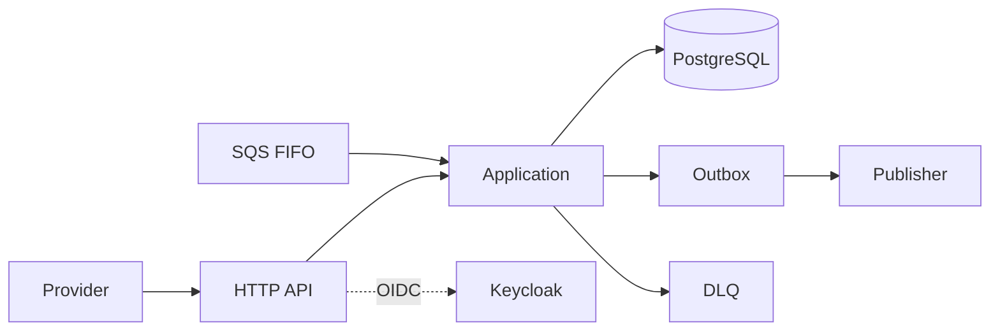
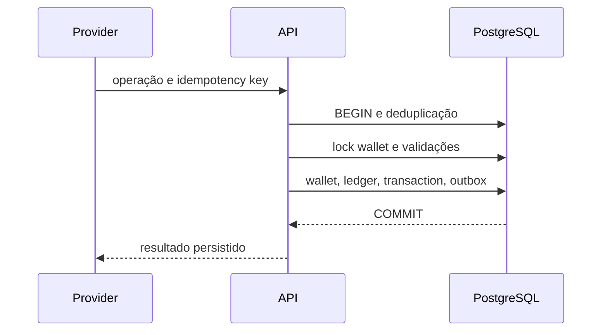
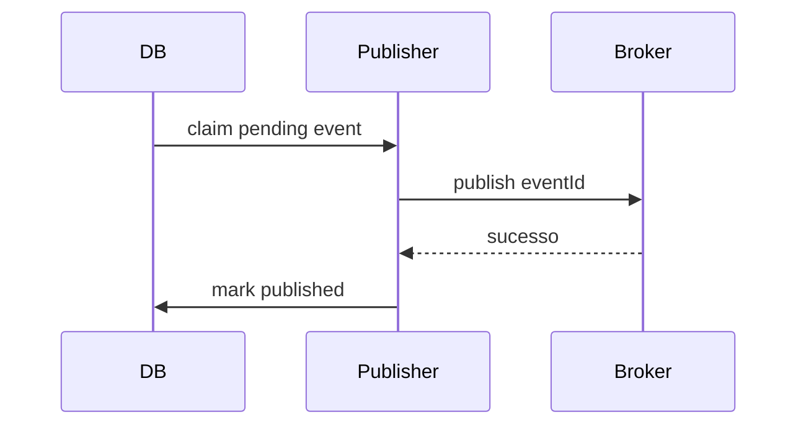
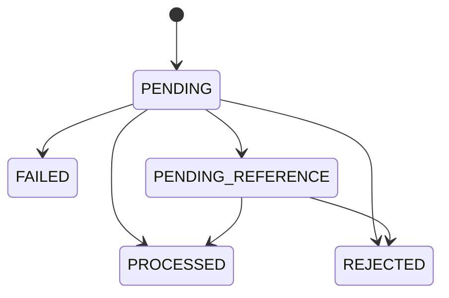

# Arquitetura

## Componentes

Domínio não conhece HTTP, SQS, Fx ou PostgreSQL. A aplicação concentra garantias financeiras; adapters traduzem protocolos; PostgreSQL é a fonte de verdade.

## Tecnologias

- Go: tipagem, concorrência, baixo consumo e race detector.
- Uber Fx: composição e lifecycle explícitos.
- PostgreSQL/pgx: transações, constraints e locks verificáveis.
- SQS/LocalStack: entrega at-least-once, retry e DLQ.
- Keycloak/OIDC: IdP externo, claims e client credentials.
- Docker Compose: ambiente reproduzível.
- int64 em centavos: precisão sem floating point.

## Fluxo financeiro

## Outbox

## Estados

Keycloak emite tokens OIDC. A API valida assinatura, issuer, audience e expiração. O provider autorizado vem de claim; roles internas protegem carteiras e reconciliação. Locks por linha e constraints impedem lost update, saldo negativo e duplicidade.
