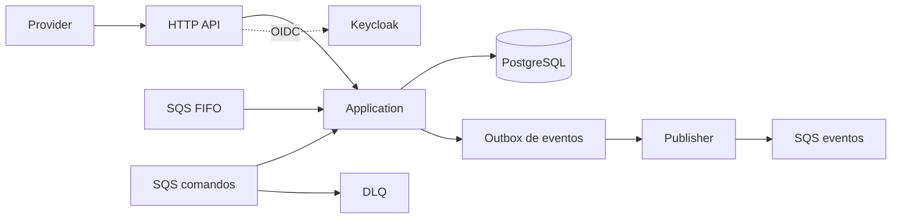
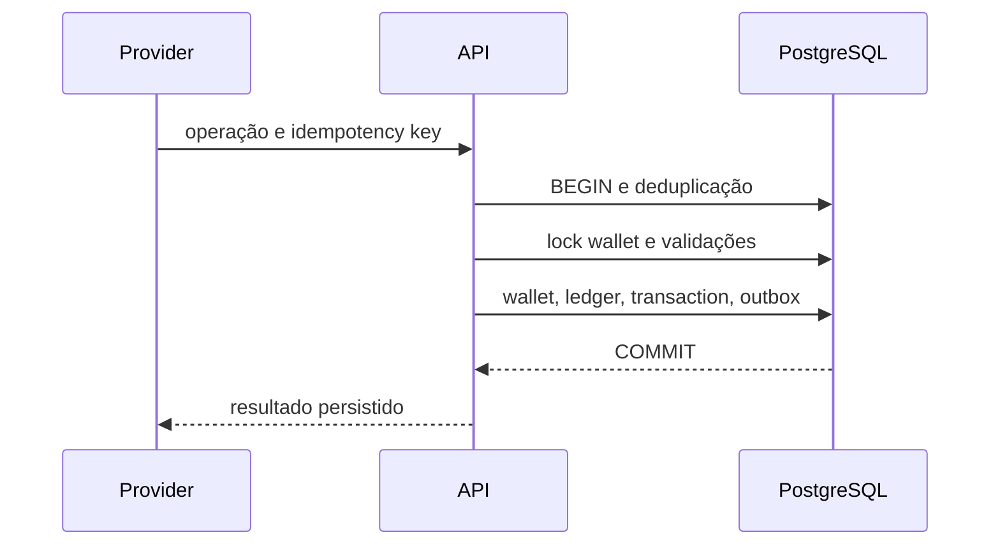
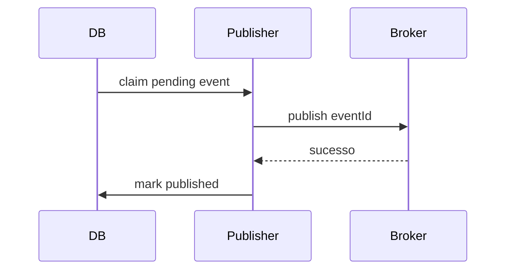
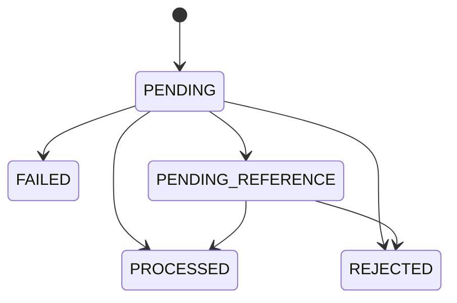

# Arquitetura — explicada passo a passo

## Para quem está chegando

O sistema é uma API que recebe uma operação, valida quem está chamando, abre uma transação no PostgreSQL, trava a carteira, atualiza o saldo e grava todos os registros necessários antes de responder. Assim, uma resposta de sucesso significa que a operação está persistida.

Em Java, é comum falar em Controller, Service, Entity e Repository. Em Go, os nomes são diferentes, mas a separação é equivalente:

| Conceito | Local | Responsabilidade |
|---|---|---|
| Entity/Value Object | `internal/domain` | dinheiro e regras básicas, sem infraestrutura |
| Service/Use case | `internal/application` e `internal/store` | validação e execução da operação |
| Controller/DTO | `cmd/api` | HTTP, JSON, status e autenticação |
| Repository/DAO | `internal/store` | SQL, transações e locks PostgreSQL |
| Consumer/Publisher | `internal/adapters/sqs` e `internal/worker` | mensagens, inbox e outbox |
| Configuração | `cmd/api/main.go` | composição e lifecycle |

## Componentes

Domínio não conhece HTTP, SQS, Fx ou PostgreSQL. A aplicação concentra garantias financeiras; adapters traduzem protocolos; PostgreSQL é a fonte de verdade.

Comandos e eventos usam filas diferentes. A fila de comandos recebe operações dos providers. A fila de eventos recebe notificações produzidas pelo outbox. Isso evita que um evento interno seja interpretado como uma nova aposta.

## Tecnologias

- Go: tipagem, concorrência, baixo consumo e race detector.
- Uber Fx: composição e lifecycle explícitos.
- PostgreSQL/pgx: transações, constraints e locks verificáveis.
- SQS/LocalStack: entrega at-least-once, retry e DLQ.
- Keycloak/OIDC: IdP externo, claims e client credentials.
- Docker Compose: ambiente reproduzível.
- int64 em centavos: precisão sem floating point.

## Fluxo financeiro

## Outbox

O publisher seleciona eventos com `FOR UPDATE SKIP LOCKED`, marca um lease temporário, publica fora da transação e depois marca `published_at`. Em caso de falha, incrementa tentativas e agenda novo retry.

## Inbox e entrega SQS

O consumidor grava a mensagem no inbox e processa a operação na mesma transação PostgreSQL. Se qualquer etapa falhar, tudo sofre rollback e o SQS mantém a mensagem para reentrega. O ack só acontece depois do commit.

## Segurança

Keycloak emite JWTs. A API valida assinatura, issuer, audience e expiração. Providers só podem operar seu próprio `providerId`; carteiras exigem o papel/client interno. Sem OIDC configurado, a API não inicia, exceto quando `DEV_MODE=true` for explicitamente usado em desenvolvimento.

## Shutdown

O Fx controla o servidor HTTP e o encerramento dos workers. Ao receber SIGTERM, os contextos são cancelados, o publisher, consumidor e worker de referências terminam o polling e o processo aguarda as goroutines antes de fechar o servidor.

## Como investigar uma requisição

Cada resposta HTTP recebe `X-Correlation-ID`. Use esse valor junto dos logs para acompanhar a requisição. Para uma operação financeira, os identificadores importantes são `providerId`, `externalTransactionId`, `transactionId` e `walletId`.

## Estados

Keycloak emite tokens OIDC. A API valida assinatura, issuer, audience e expiração. O provider autorizado vem de claim; roles internas protegem carteiras e reconciliação. Locks por linha e constraints impedem lost update, saldo negativo e duplicidade.
