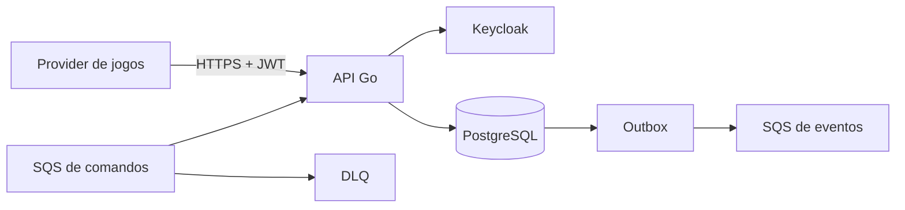

# Backend Challenge Go

Serviço de processamento distribuído de apostas. Os requisitos estão em spec.md, o plano técnico em spec tecnica.md e a execução incremental em plan.md.

## O que este projeto faz

Este serviço recebe operações financeiras de jogos, como aposta (`BET`), prêmio (`WIN`), perda (`LOSS`) e reversões (`REFUND` e `ROLLBACK`). Ele mantém o saldo da carteira, grava um ledger imutável e publica eventos para outros sistemas.

O dinheiro nunca é representado por `float`: `R$ 10,25` vira `1025` centavos em um inteiro de 64 bits. Isso evita erros de arredondamento.

## Visão rápida da arquitetura



O PostgreSQL é a fonte de verdade. O SQS usa entrega pelo menos uma vez; por isso a operação é idempotente e o inbox impede o processamento repetido de mensagens concluídas.

## Subir o ambiente
Pré-requisitos: Docker com Compose e Go 1.27+.
```bash
cp .env.example .env
docker compose up --build
```

Para executar em segundo plano:

```bash
docker compose up --build -d
docker compose ps
```
Serviços: API em localhost:8081, Keycloak em localhost:8080 (admin/admin), PostgreSQL em localhost:5432 e LocalStack em localhost:4566.

Para parar sem apagar dados:

```bash
docker compose down
```

Para recomeçar do zero, apagando volumes locais:

```bash
docker compose down -v
docker compose up --build -d
```

## Keycloak e tokens locais

O realm jungle-gaming é importado automaticamente. Para obter um token de provider, faça um POST para:

    http://localhost:8080/realms/jungle-gaming/protocol/openid-connect/token

Envie form-urlencoded com client_id=provider-a, client_secret=provider-a-secret e grant_type=client_credentials. Use o access_token como Authorization: Bearer TOKEN. O client interno é wallet-internal com secret internal-secret.
```bash
curl http://localhost:8081/health/live
curl http://localhost:8081/health/ready
```
O realm jungle-gaming é importado de deploy/keycloak/realm-export.json. Os clients locais são provider-a, provider-b e wallet-internal. Substitua os segredos em ambientes reais.

O client `provider-a` representa um provedor de jogos. O client `provider-b` representa outro provedor. O client `wallet-internal` é usado por operações internas de carteira. Em produção, os segredos devem vir de um gerenciador de segredos.

### Papéis e autorização

O token precisa conter um dos papéis do realm abaixo:

- `provider:transactions`: permite enviar e consultar transações de apostas. O provider do token também precisa ser igual ao `providerId` da operação.
- `internal:wallets`: permite criar, consultar, consultar o ledger e reconciliar carteiras.

Nos clients locais, `provider-a` e `provider-b` são reconhecidos como providers e `wallet-internal` como client interno. Em produção, atribua explicitamente os papéis aos service accounts no Keycloak e remova os segredos de exemplo.

Exemplo para obter um token de provider:

```bash
TOKEN=$(curl -sS -X POST \
  http://localhost:8080/realms/jungle-gaming/protocol/openid-connect/token \
  -H 'Content-Type: application/x-www-form-urlencoded' \
  -d client_id=provider-a \
  -d client_secret=provider-a-secret \
  -d grant_type=client_credentials | jq -r .access_token)

curl -H "Authorization: Bearer $TOKEN" \
  http://localhost:8081/providers/provider-a/wagering/transactions/EXTERNAL_ID
```

O endpoint `/metrics` e os health checks são públicos; as demais rotas exigem token válido e papel compatível.

## Desenvolvimento
```bash
gofmt -w .
go test ./...
go test -race ./...
go vet ./...
docker compose down
```
Testes unitários usam mocks das portas; testes de integração devem usar PostgreSQL, Keycloak e LocalStack reais.

O comando `go test ./...` executa os testes rápidos e ignora os testes que exigem infraestrutura. O comando abaixo executa a integração real:

Para executar a integração contra o Compose:

    INTEGRATION=true go test ./tests/integracao -v

Validações recomendadas antes de abrir um pull request:

```bash
gofmt -w .
go test ./...
go test -race ./...
go vet ./...
docker compose config --quiet
INTEGRATION=true go test ./tests/integracao -v
```

O workflow `.github/workflows/ci.yml` executa essas verificações, constrói a imagem e sobe o Compose no GitHub Actions.

### Operação das filas e banco

As filas FIFO são criadas pelo serviço `filas`: `wager-transactions.fifo` e sua DLQ `wager-transactions-dlq.fifo`. Para confirmar o provisionamento:

```bash
AWS_ACCESS_KEY_ID=test AWS_SECRET_ACCESS_KEY=test AWS_DEFAULT_REGION=us-east-1 \
  aws --endpoint-url http://localhost:4566 sqs list-queues
```

As migrations são executadas automaticamente pelo serviço `migrate`. Para recriar todo o ambiente local, removendo dados de PostgreSQL, Keycloak e LocalStack:

```bash
docker compose down -v
docker compose up --build -d
docker compose ps
```

### Teste manual dos endpoints

Depois de obter um token de provider, envie uma transação com `Idempotency-Key`:

```bash
curl -X POST http://localhost:8081/wagering/transactions \
  -H "Authorization: Bearer $TOKEN" \
  -H 'Content-Type: application/json' \
  -H 'Idempotency-Key: exemplo-1' \
  -d '{"providerId":"provider-a","externalTransactionId":"exemplo-1","walletId":"WALLET_ID","playerId":"PLAYER_ID","roundId":"round-1","gameId":"game-1","kind":"BET","money":{"amount":"10.00","currency":"BRL"}}'
```

Consultas usam `GET /wagering/transactions/{transactionId}` ou `GET /providers/{providerId}/wagering/transactions/{externalTransactionId}`. Carteiras e ledger exigem token do client `wallet-internal`:

```bash
curl -H "Authorization: Bearer $TOKEN_INTERNO" http://localhost:8081/wallets/WALLET_ID
curl -H "Authorization: Bearer $TOKEN_INTERNO" http://localhost:8081/wallets/WALLET_ID/ledger
curl -X POST -H "Authorization: Bearer $TOKEN_INTERNO" http://localhost:8081/wallets/WALLET_ID/reconciliation
```

Em caso de falha, verifique `docker compose ps`, `docker compose logs app`, `docker compose logs migrate` e os endpoints de health. O endpoint `/metrics` ajuda a identificar volume de requisições, erros, duplicidades e eventos publicados.

## Documentação
spec.md contém requisitos funcionais; spec tecnica.md contém arquitetura técnica; plan.md contém tarefas/BDD; ARCHITECTURE.md contém decisões e diagramas; docs/architecture.md explica a correspondência com Controller/Service/Entity do Java; docs/openapi.yaml é o contrato Swagger/OpenAPI.

## Endpoints principais

| Endpoint | Quem usa | Objetivo |
|---|---|---|
| `GET /health/live` | monitoramento | confirma que o processo está vivo |
| `GET /health/ready` | monitoramento | confirma que o banco está disponível |
| `GET /metrics` | Prometheus | expõe métricas |
| `POST /wallets` | serviço interno | cria carteira |
| `GET /wallets/{id}` | serviço interno | consulta saldo |
| `GET /wallets/{id}/ledger` | serviço interno | consulta lançamentos |
| `POST /wallets/{id}/reconciliation` | serviço interno | reconcilia saldo e ledger |
| `POST /wagering/transactions` | provider | processa operação financeira |
| `GET /wagering/transactions/{id}` | provider | consulta transação interna |
| `GET /providers/{provider}/wagering/transactions/{external}` | provider | consulta por referência externa |

O contrato detalhado está em [`docs/openapi.yaml`](docs/openapi.yaml).

## Troubleshooting

- API não inicia: execute `docker compose logs app` e confirme que Keycloak e PostgreSQL estão saudáveis.
- `401`: obtenha um token novo no Keycloak e envie `Authorization: Bearer TOKEN`.
- `403`: confirme que o provider do token é igual ao `providerId` e que o token interno está sendo usado para carteiras.
- `503` no readiness: execute `docker compose logs postgres migrate`.
- Filas ausentes: execute `docker compose logs filas` e liste as filas com o AWS CLI apontando para `http://localhost:4566`.
- Migration travada: `docker compose down -v` e suba novamente em ambiente local descartável.
