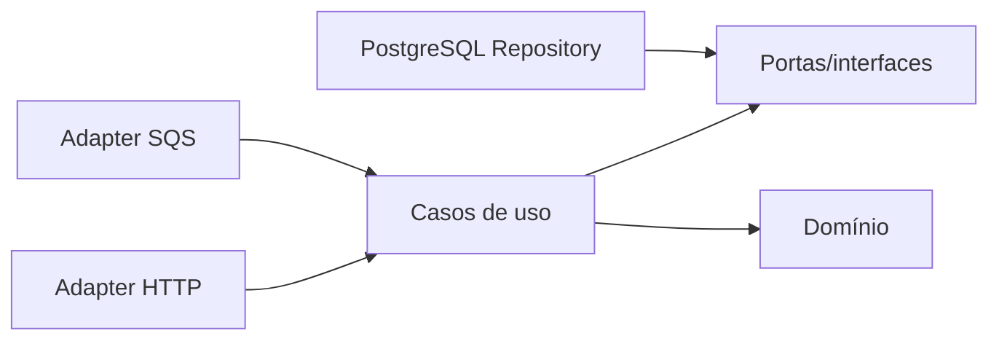

# Arquitetura do projeto

Este documento explica a organização para quem conhece Java, mas ainda não conhece Go. O objetivo da arquitetura é separar regras de negócio de detalhes de transporte e infraestrutura.

O projeto usa Clean Architecture e Arquitetura Hexagonal (Ports and Adapters).

| Java tradicional | Este projeto Go |
|---|---|
| Entity / Value Object | internal/domain |
| Service / Use Case | internal/application |
| Controller | internal/adapters/http |
| Repository / DAO | internal/store |
| Message Consumer | internal/adapters/sqs |
| Configuration / Main | cmd/api |
| DTO | estruturas dos adapters |

### Fluxo

Dependências sempre apontam para dentro. O domínio não conhece banco, HTTP, SQS ou framework.

## Como uma requisição percorre o sistema

1. O cliente envia JSON e um JWT.
2. O middleware valida o JWT no Keycloak.
3. O handler transforma JSON em um DTO tipado.
4. O caso de uso valida dinheiro, identidade, idempotência e tipo da operação.
5. O store abre uma transação PostgreSQL e trava a carteira com `FOR UPDATE`.
6. A mesma transação grava transação, saldo, ledger, inbox/outbox quando aplicável.
7. Após o commit, a API responde ao cliente.

Se ocorrer erro antes do commit, o PostgreSQL desfaz todas as alterações. Essa é a principal garantia contra saldo parcialmente atualizado.

## Como começar a ler o código

1. Comece por `cmd/api/main.go`: ele mostra as rotas e a composição.
2. Leia `internal/domain/money.go`: explica como valores monetários são representados.
3. Leia `internal/application/wager.go`: mostra as validações da operação.
4. Leia `internal/store/postgres.go`: contém transações, locks, ledger e outbox.
5. Leia `internal/adapters/sqs`: contém o protocolo de mensagens.
6. Leia `tests/integracao/api_test.go`: mostra os fluxos completos via HTTP.

## Decisões importantes

- PostgreSQL é a fonte de verdade; SQS transporta comandos/eventos.
- Dinheiro é inteiro em centavos, nunca `float`.
- Idempotência é persistida, não apenas mantida em memória.
- Ledger é append-only e possui trigger que impede alteração.
- Comandos e eventos não compartilham a mesma fila.
- OIDC é obrigatório fora de `DEV_MODE`.

Regras: domain contém entidades e invariantes; application contém casos de uso e portas; adapters/http contém rotas, middleware e DTOs; adapters/sqs contém consumidor e inbox; store contém SQL, locks e repositories; cmd/api compõe dependências e lifecycle.

A especificação OpenAPI está em docs/openapi.yaml e deve ser atualizada com cada mudança de endpoint.
