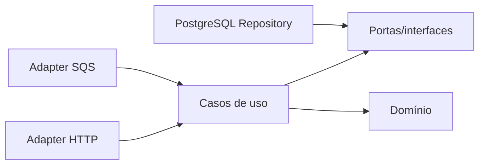

# Arquitetura do projeto

O projeto usa Clean Architecture e Arquitetura Hexagonal (Ports and Adapters).

| Java tradicional | Este projeto Go |
|---|---|
| Entity / Value Object | internal/domain |
| Service / Use Case | internal/application |
| Controller | internal/adapters/http |
| Repository / DAO | internal/store |
| Message Consumer | internal/adapters/sqs |
| Configuration / Main | cmd/api |
| DTO | estruturas dos adapters |

### Fluxo

Dependências sempre apontam para dentro. O domínio não conhece banco, HTTP, SQS ou framework.

Regras: domain contém entidades e invariantes; application contém casos de uso e portas; adapters/http contém rotas, middleware e DTOs; adapters/sqs contém consumidor e inbox; store contém SQL, locks e repositories; cmd/api compõe dependências e lifecycle.

A especificação OpenAPI está em docs/openapi.yaml e deve ser atualizada com cada mudança de endpoint.
